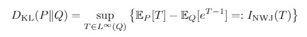
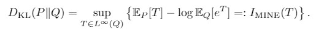
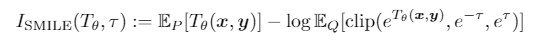

# Smoothed Mutual Information ``Lower Bound'' Estimator

PyTorch implementation for the paper [Understanding the Limitations of Variational Mutual Information Estimators](https://arxiv.org/abs/1910.06222), ICLR 2020.

by Jiaming Song and Stefano Ermon, Stanford Artificial Intelligence Laboratory.

---

## Running the experiments

The code depends on PyTorch >= 1.2, numpy, pandas and matplotlib. It has been tested on both Python 3.7.

We implement several mutual information estimators, including:
- InfoNCE: Contrastive predictive coding / Info Noise Contrastive Estimation.

- NWJ: Variational representation of the KL divergence (lower bound).

- NWJ (JS): Train with variational representation of JS divergence lower bound, evaluate with KL.
- MINE / DV: Variational representation of the KL divergence based on Donsker-Varadhan inequality.

- SMILE: our method with clipping for estimating partition functions.


These functions are implemented in `estimators.py`.

See `demo.ipynb` for the procedures to produce the figures in the paper. 


---

## Citation

If you use this code for your research, please cite our paper:

```
@article{song2020understanding,
  title="Understanding the Limitations of Variational Mutual Information Estimators",
  author="Song, Jiaming and Ermon, Stefano",
  conference="International Conference on Learning Representations",
  year="2020"
}
```

## Contact

[tsong@cs.stanford.edu](tsong@cs.stanford.edu)